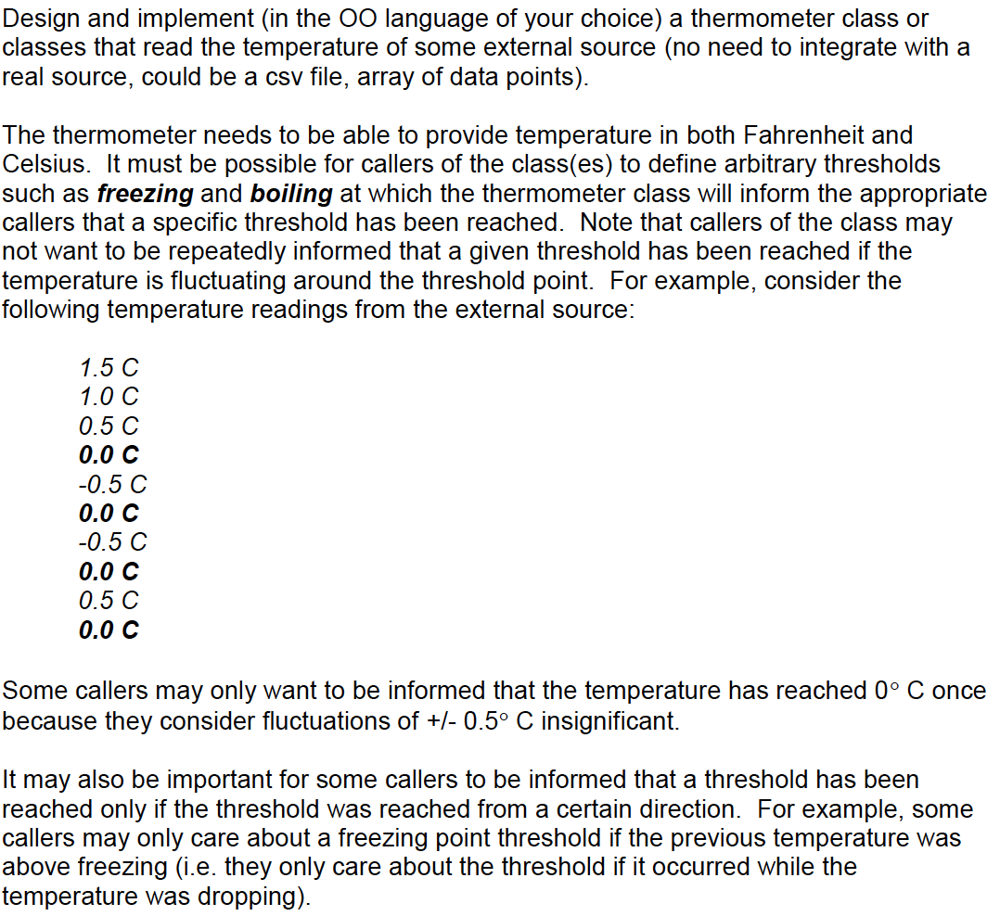

# Thermometer_question

# To use the Thermometer class

'''
Thermometer tm = new Thermometer();

Settings settings = SettingsFactory.get("Freezing");

tm.listen(settings, new Callback() {

            public void execute() {
                //Do something when its freezing.
            }
});

tm.readData(somecsvfilepath);

'''

# Original question

